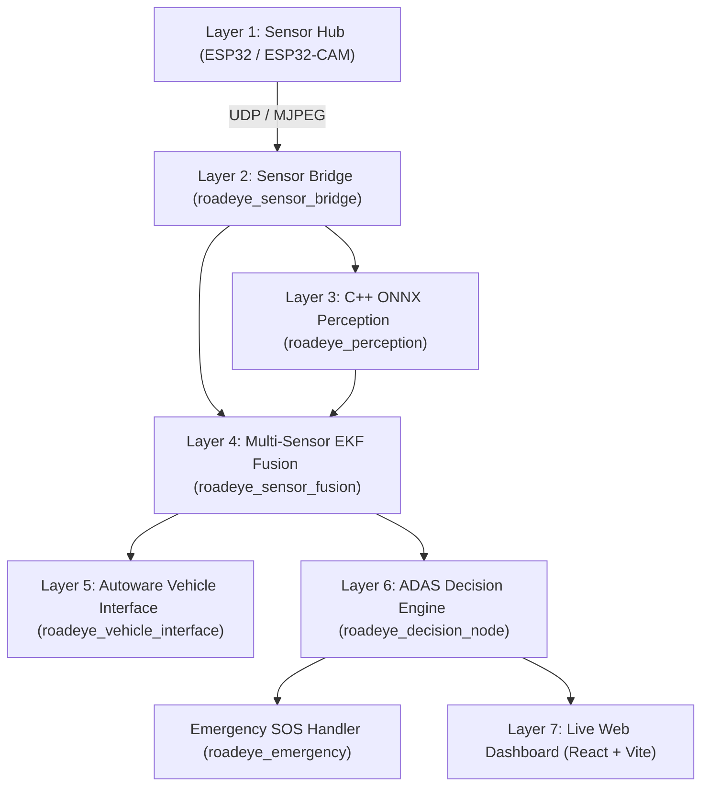

# RoadEye — Open Source Level-3 ADAS for Indian Roads

[](https://docs.ros.org/en/humble/)
[](https://en.cppreference.com/w/cpp/17)
[](LICENSE)
[](https://sih.gov.in/)

RoadEye is a modular, high-performance **Level-3 ADAS research prototype** engineered specifically for the chaotic, dynamic, and unstructured driving conditions of Indian roads. 

Built using **Vision Pilot** as the primary perception engine, selected **Autoware** modules for localization and ROS2 infrastructure, **ESP32 DevKit V1 & ESP32-CAM** sensor hubs, and a modern **C++17 ONNX Runtime** multi-sensor fusion and decision stack.

---

## 🚗 Core Features

- **Forward Collision Warning (FCW)**: Time-To-Collision (TTC) calculations based on spatial EKF fusion.
- **Automatic Emergency Braking Recommendation (AEB Rec)**: Pure decision recommendation logic (driver retains 100% vehicle control).
- **Lane Departure Warning (LDW) & Lane Keeping Assistance (LKA Rec)**: Real-time lane boundary tracking and deviation alerts.
- **Pothole Detection & Severity Scoring**: Real-time road anomaly detection using YOLOv8 segmentation.
- **Driver Monitoring System (DMS)**: Eye closure ratio (PERCLOS) and drowsiness detection.
- **Emergency SOS Handler**: Automatic crash verification combining IMU impact (>4g), OBD-II speed drop, and SIM800L SMS dispatch.
- **Live Web Dashboard**: Modern React + Vite + Leaflet dashboard with real-time video feeds, gauge widgets, and sensor matrix.

---

## 🎨 UI/UX & C++ Perception Stability Upgrades

We recently overhauled the dashboard visual identity and C++ backend nodes to elevate stability and cockpit usability:

### 1. Professional ADAS Navy Theme
- **Theme Palette**: Replaced generic grey colors with an automotive-grade system: Main Background (`#07111F`), Sidebar (`#0B1728`), Cards/Panels (`#101F33`), and Borders (`#263B55`).
- **Accent Systems**: Mapped specific color codes to sensor parameters to maximize contrast (Electric Blue `#00A8FF` for Speed, Green `#22C55E` for RPM, Orange `#FF9F1C` for LiDAR, Magenta `#FF3D81` for Risk, and Red `#FF3B4D` for SOS).

### 2. Multi-View Interactive Tabs
- Enabled dynamic layout routing based on selected sidebar navigation items. Clicking tabs seamlessly updates the main panel (Overview cockpit, full-page Live Stream camera feed, Sensor Hub Leaflet tracker map, full-width Telemetry plotters, or Settings configuration).

### 3. Expanded Camera Perception Preview
- Enlarged the center **Front Camera Perception Stream** viewport to a massive `col-span-8` grid width and `450px` height.
- Patched the canvas from `object-cover` to `object-fill` to prevent critical hazard bounding boxes (like pothole markers at the bottom edge) from getting cropped by the container.

### 4. Resolved C++ `std::bad_weak_ptr` Startup Crash
- Fixed a ROS2 Humble startup exception in `perception_node.cpp` caused by calling `image_transport::ImageTransport`'s constructor inside the node class constructor (which illegally invokes `shared_from_this()` before the instance is wrapped in a shared pointer). Lazy-initialization is now used inside the image subscription callbacks.

---

## 🏗️ Layered Architecture Overview



---

## 📂 Repository Structure

```
RoadEye/
├── docs/                      # Exhaustive SIH 2026 documentation suite
├── firmware/                  # PlatformIO firmware for ESP32 Sensor Hub & ESP32-CAM
├── ai_models/                 # Model export, ONNX conversion & benchmarking scripts
├── models/                    # ONNX & PyTorch perception model weights
├── ros2_ws/                   # Production C++17 ROS2 Workspace
│   └── src/
│       ├── roadeye_dashboard_msgs
│       ├── roadeye_utils
│       ├── roadeye_sensor_bridge
│       ├── roadeye_perception
│       ├── roadeye_sensor_fusion
│       ├── roadeye_decision_node
│       ├── roadeye_emergency
│       └── roadeye_vehicle_interface
├── configs/                   # Modular YAML configuration files
├── launch/                    # ROS2 Full-stack, CARLA simulation & RViz launchers
├── dashboard/                 # React 18 + Vite + Tailwind CSS Web Dashboard
├── scripts/                   # Setup, build, and development runner scripts
└── simulation/                # CARLA ROS2 bridge configs & RViz layouts
```

---

## ⚡ Quickstart Guide

### 1. Prerequisites & Building

```bash
# Clone the repository
git clone https://github.com/MOHAMMADARFATHWR/roadeye_models.git RoadEye
cd RoadEye

# Setup dependencies
./scripts/setup.sh

# Build ROS2 C++ Workspace
./scripts/build_ros2.sh
```

### 2. Launch Full ADAS Stack

```bash
# Launch ROS2 Stack & Web Dashboard
./scripts/run_dev.sh
```

---

## 📖 Documentation Directory

- [SIH 2026 Proposal & Idea](docs/idea.md)
- [System Design & Layered Architecture](docs/design.md)
- [Perception, Fusion & Decision Pipeline](docs/pipeline.md)
- [AI Models & ONNX Pipeline](docs/models.md)
- [Hardware Wiring & Schematics](docs/hardware.md)
- [Deployment Guide (RPi 5 & Jetson Orin)](docs/deployment.md)
- [Testing & CARLA Simulation Guide](docs/testing.md)
- [C++ API Reference](docs/api_reference.md)
- [ROS2 Topic Directory](docs/ros2_topics.md)
- [Troubleshooting Manual](docs/troubleshooting.md)

---

## 📄 License
This project is released under the Apache-2.0 License.
