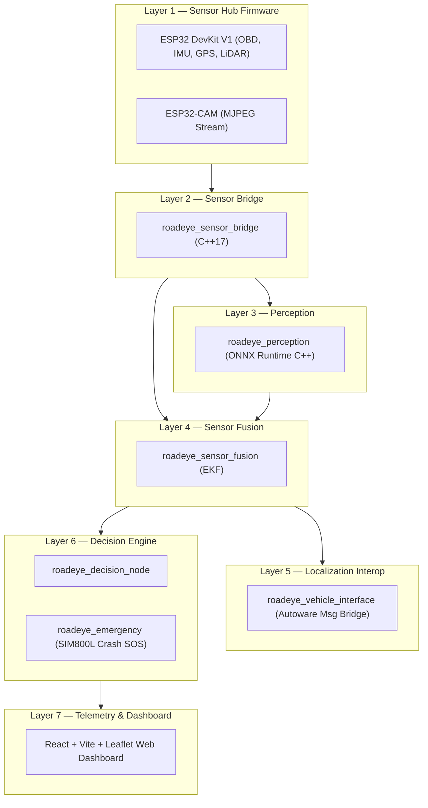

# RoadEye — System Architecture & Modular Design

## Modular Layered Architecture

RoadEye is structured into 7 isolated execution layers:

## C++17 Principles
- **RAII & Smart Pointers**: `std::unique_ptr` and `std::shared_ptr` throughout.
- **Thread Safety**: Non-blocking UDP streams and mutex-guarded state locks.
- **Zero Raw Pointers**: Full adherence to modern C++ memory management standards.
