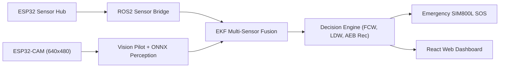

# RoadEye — SIH 2026 Idea & Problem Statement

## Problem Statement

Indian road infrastructure presents unique ADAS challenges:
1. **Unstructured Traffic**: Mixed traffic with auto-rickshaws, two-wheelers, pedestrians, and animals in close proximity.
2. **Road Anomaly Hazards**: Unmarked potholes, uneven road shoulders, and missing lane markings.
3. **High Deceleration & Crash Rates**: High frequency of rear-end collisions due to abrupt braking.

---

## Proposed Solution: RoadEye ADAS

RoadEye provides an open-source, affordable Level-3 ADAS research prototype engineered specifically for Indian roads:

### Safety Policy
> [!IMPORTANT]
> **Driver Control Guarantee**: RoadEye is strictly a driver-assist and safety warning stack. It **never** executes autonomous control (steering, braking, throttle) over the physical vehicle.
