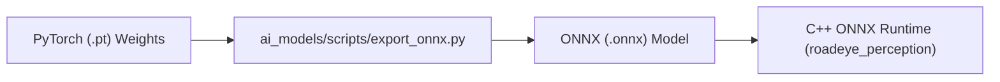

# RoadEye — AI Models & ONNX Inference

## Integrated Models Specification

| Task | Architecture | ONNX Path | PT Path | Input Size |
|---|---|---|---|---|
| Object Detection | YOLO11 Indian Road | `models/detection/yolo26n_indian_road_best.onnx` | `models/detection/yolo26n_indian_road_best.pt` | 640x640 |
| Road Segmentation | YOLO11 Road Seg | `models/segmentation/yolo11m-road-seg.onnx` | `models/segmentation/yolo11m-road-seg.pt` | 640x640 |
| Pothole Detection | YOLOv8 Pothole | `models/pothole/pothole-detection-yolov8.onnx` | `models/pothole/pothole-detection-yolov8.pt` | 640x640 |
| Depth Estimation | UNet Depthwise Nano | `models/depth/unet_depthwise_nano_best.onnx` | `models/depth/unet_depthwise_nano_best.pt` | 256x256 |

---

## Conversion & Deployment Pipeline

> [!NOTE]
> Training source `.pt` files are permanently retained alongside `.onnx` for reproducibility.
