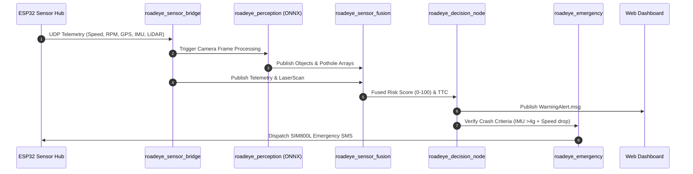

# RoadEye — Dataflow & Processing Pipeline

## End-to-End Execution Sequence

---

## EKF Fusion Equations

Spatial EKF state update combines Camera depth estimates \(d_{cam}\) and LiDAR ranges \(d_{lidar}\):

\[ d_{fused} = w_{cam} d_{cam} + w_{lidar} d_{lidar} \]

Where \(w_{cam} = 0.40\) and \(w_{lidar} = 0.60\).
